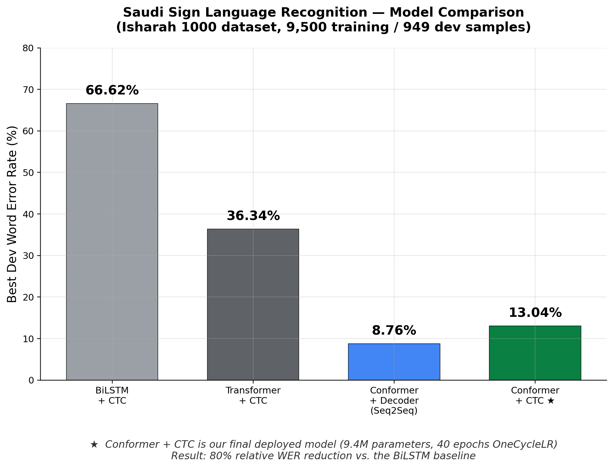

# Saudi Sign Language Recognition

Translating continuous Saudi Sign Language into Arabic text from skeleton pose data.

A signer produces a full sentence on video; the system reads the sequence of body, hand and face keypoints and outputs the corresponding sequence of Arabic gloss tokens. Four sequence architectures are built and compared on the same data, same split, and same metric.

**13.04% word error rate**, an **80% relative reduction** over the recurrent baseline.

Authors: Mohammed Al Sheqaih, Abdulrahman Ammar, Naif Alenazi
Supervisor: Dr. Hamzah Luqman
Deep Learning, King Fahd University of Petroleum and Minerals

The full technical write-up is in [`report.pdf`](report.pdf).



---

## Results

Word error rate on the development split, 949 sentences, signer-independent.

| Model | Dev WER | Notes |
|:---|:---|:---|
| BiLSTM + CTC | 66.62% | baseline |
| Transformer + CTC | 36.34% | still improving when training stopped |
| **Conformer + CTC** | **13.04%** | **deployed; the only model submitted on the 3,800-sentence test set** |
| Conformer + Seq2Seq | 8.76% | lower number, not deployable — see below |

The headline is the Conformer with CTC at **13.04%**, down from the BiLSTM's 66.62%: a **80% relative reduction** with no change to the input representation.

---

## The result that matters most is the one we did not ship

The Conformer with a Seq2Seq decoder reaches **8.76%** dev WER, the lowest number in the project. It is not the model we deployed, and the reason is the most useful thing here.

Its own error analysis reports an **average length difference of +10.86 tokens**: asked for a three-word sentence, it emits thirteen or fourteen. It fails to produce the end-of-sequence token and generates repetitive loops until it hits the decode limit. The words it misses most often are `انا`, `هو`, `سوال` — not difficult signs, simply the most common words, missed because the output has stopped tracking the input at all.

That behaviour and a 8.76% WER cannot both describe the same system, and the evaluation code shows why. `evaluate()` truncates each prediction at its first EOS token before scoring, so everything generated after EOS never reaches the metric. The qualitative analysis measures the raw generation; the WER measures a cleaned-up version of it. **They are not the same decoding path, so the two results are not in conflict — they are answers to different questions.**

The conclusion is one worth carrying beyond this project: **a lower validation number does not mean a better system.** A model can rank first on the leaderboard and be unusable, and the only way to find out is to read what it actually produces. The 13.04% CTC model was submitted on the test set; the 8.76% model was not.

---

## What made the difference

**Architecture, at the encoder.** The four models share an input representation and a vocabulary; they differ in how they encode a pose sequence.

The BiLSTM flattens each frame into a vector, which destroys the geometric relationships between joints — and hand-to-face distance is exactly the kind of signal that distinguishes one sign from another. It also carries information forward through a single recurrent state, so it struggles to relate a hand shape at frame 10 to a movement at frame 90.

The Conformer pairs self-attention, which relates any two frames directly regardless of distance, with a convolutional module that captures the local frame-to-frame motion. That combination is what takes 66.62% to 13.04% on identical inputs.

**CTC over an autoregressive decoder, for this data.** CTC assumes monotonic alignment between input and output, which is true of sign language: signs are produced in order. An autoregressive decoder can attend anywhere and, on 9,500 training sentences, learned to generate fluent-looking Arabic that had stopped depending on the video.

---

## Data

**Isharah 1000**, the continuous Saudi Sign Language corpus, signer-independent partition. Skeleton keypoints are supplied by the dataset providers, already extracted with MediaPipe Holistic; raw video is never used.

| Split | Sentences |
|:---|---:|
| Train | 10,000, of which **9,500** have a matching pose record |
| Dev | 949 |
| Test | 3,800 |

Each sample is a sequence of `T` frames × **86 joints** × 2 coordinates. Joint positions are augmented with per-frame velocities, giving **344 features** per frame. The gloss vocabulary is **675 words**, 677 with special tokens.

**The corpus is not in this repository.** It is obtained from the Isharah dataset providers. The notebooks expect:

```
public_si_dat/
├── train.csv                 id,gloss
├── dev.csv                   id,gloss
└── pose_data_*.pkl           keypoints keyed by sample id
pose_data_isharah1000_SI_test.pkl
```

---

## Notebooks

| Notebook | Contents |
|:---|:---|
| [`01-bilstm-and-conformer-ctc.ipynb`](notebooks/01-bilstm-and-conformer-ctc.ipynb) | Data loading, pose preprocessing, vocabulary, the BiLSTM baseline, and the Conformer with CTC that produced the final result |
| [`02-transformer-ctc.ipynb`](notebooks/02-transformer-ctc.ipynb) | Transformer encoder with CTC, beam search decoding |
| [`03-conformer-seq2seq.ipynb`](notebooks/03-conformer-seq2seq.ipynb) | Conformer encoder with an autoregressive decoder, and the collapse described above |

`generate_figures.py` rebuilds every figure in `figures/` and `report/figures/` from the per-epoch numbers recorded in the notebooks.

---

## Honest caveats

**All four numbers are dev WER, not test WER.** Only the Conformer with CTC was run on the 3,800-sentence test set, and that submission's score is not in this repository. Comparisons between the four models are like-for-like; the 13.04% is a development figure.

**The BiLSTM baseline was stopped early.** Training was interrupted at epoch 37 with the best checkpoint at epoch 34, after the curve flattened, to redirect a limited Colab GPU budget toward the stronger architectures. Its 66.62% is therefore a floor on what that architecture reached, not a converged result. It was still improving slowly.

**The Transformer was cut short too.** Its best WER arrives at epoch 30 of 30, so it had not converged when training ended. 36.34% understates it.

**The Seq2Seq training cell carries stored output but no execution count**, meaning the log predates the notebook's current state. Its 8.76% should be read alongside the decoding discussion above rather than taken at face value.

**Augmentation is described in the report but its effect is not isolated.** No ablation separates the contribution of time warping, rotation, scaling and noise from the architecture change.

---

## Running this

```bash
pip install -r requirements.txt
```

Place the corpus as shown above, then run the notebooks in order. They were developed on Colab GPUs; the Conformer with CTC is 9.4M parameters and trains in roughly forty epochs.

---

## References

- Gulati et al., *Conformer: Convolution-augmented Transformer for Speech Recognition* (2020)
- Graves et al., *Connectionist Temporal Classification* (2006)
- Vaswani et al., *Attention Is All You Need* (2017)
- Isharah: continuous Saudi Sign Language corpus
